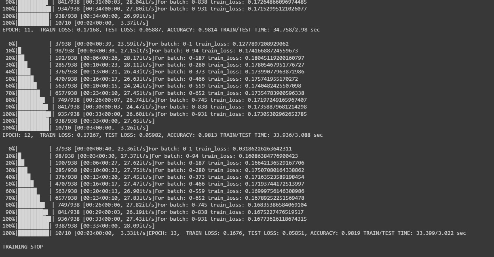

# Implemented/TODO:
```
1.   CUDA gpu/cpu ✅
2.   Early stopping ✅
3.   Log interval ✅ ! Poprawic TQDM
4.   TQDM ✅
5.   Scheduler + start epoch ✅
6.   Visualization ✅
7.   batch size max (ogarnac quantization oraz gpu/cpu kiedy warto max dac) ❌
8.   Time of epoch i podsumowanie jak w tensorflow bylo train test itd ✅
9.   Plotowanie w loss nie co epoke tylko co pol albo 100 przykladow albo cos innego wymyslic ✅
10.  Confusion Matrix ✅
11.  Dummy classifier ile bedzie mial (z uwzglednieniem niezbalansowania datasetu ale to chyba na jedno wyjdzie) ✅
12. save best ✅
13. Accuracy ✅
14. EDA bad examples plot ❌
15. model checkpoint like in keras eg. save every 5 epoch or save only Weights / all model ❌
16. BackupAndRestore if training stopped train again ❌
17. Weights and biases connect / tensorboard ❌
18. RemoteMonitor stramuje trening na serwer to mozna W&B ❌
19. TerminateOnNaN jesli bedzie vanish albo explode gradient to stop ❌
20. CSVLogger zapisz trening do csv pandas dataframe zrobic ✅
21. Ideas from [W&B Article](https://wandb.ai/wandb_fc/tips/reports/How-to-Write-Efficient-Training-Loops-in-PyTorch--VmlldzoyMjg4OTk5) e.g. gradient accumulation ❌
```


0. ### Example use

For more info check files

1. ### Exapmle result


Plot Confusion Matrix with matrix.py
